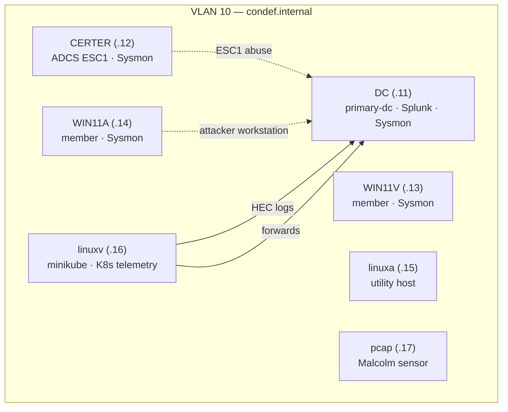

# Constructing Defense

A single-domain detection-engineering lab. A Windows AD forest (`condef.internal`) with an
ADCS server misconfigured for ESC1, Sysmon on every Windows host, a Splunk SIEM collecting
Windows/Linux/Kubernetes telemetry, a Malcolm network-monitoring sensor, a minikube cluster
emitting K8s telemetry, and a docker host running VECTR, Ghostwriter and BloodHound CE.

## Topology



## VMs

| VM      | Template                              | IP   | Role in lab                                   |
|---------|---------------------------------------|------|-----------------------------------------------|
| DC      | win2022-server-x64-template           | .11  | Domain controller, Splunk server, HEC token   |
| CERTER  | win2022-server-x64-template           | .12  | ADCS CA, vulnerable to ESC1                    |
| WIN11V  | win11-22h2-x64-enterprise-template    | .13  | Domain member, Splunk UF                       |
| WIN11A  | win11-22h2-x64-enterprise-template    | .14  | Domain member / attacker workstation          |
| linuxa  | debian-13.5-x64-server-no-template         | .15  | General-purpose Linux host                     |
| linuxv  | debian-13.5-x64-server-no-template         | .16  | minikube cluster + K8s→Splunk telemetry        |
| pcap    | debian-13.5-x64-server-no-template         | .17  | Malcolm network monitoring (64 GB RAM)         |

All templates are stock Ludus built-ins — this source ships no Packer templates.

## Malcolm packet capture bridge

The `pcap` VM runs `ludus_configure_bridge` before `ludus_install_malcolm`.
On a single-node Ludus host, the bridge role automatically derives the current
range bridge as `vmbr{{ 1000 + range_second_octet }}`; no bridge name is
hardcoded in the automated path. It enables promiscuous mode and sets the
bridge ageing time to `0`, then installs an ifupdown2 interface-up hook that
reapplies both settings whenever that range bridge comes up.

The role changes the bridge on the Ludus/Proxmox host through one local,
privilege-escalated execution even though it is assigned to `pcap`. It supports
single-node Ludus only and does not create bridges, restart networking, or
configure individual VLANs independently.

To apply or reapply these settings directly on the host once the range bridge
exists, run the [host playbook](../../ludus-configure-bridge.yaml) from the
repository root **on the single-node Ludus/Proxmox host**, with Ansible installed:

```sh
sudo ansible-playbook ludus-configure-bridge.yaml -e range_second_octet=3
```

Replace `3` with this range's numeric `range_second_octet` allocation (1–254),
not its textual range ID. This example configures `vmbr1003` (`1000 + 3`).
The playbook runs locally on the host and requires the bridge to already exist.

Removing the role or deleting this blueprint's range does not remove its
persistent host hook. Before deleting the range or reusing its numeric
allocation, follow the bridge role's exact
[retirement procedure](../../ansible/roles/ludus_configure_bridge/README.md#retiring-a-range-or-this-role).

## Credentials

- Domain admin: `condef.internal\domainadmin` / `Temp1234!!`
- Splunk (`http://dc:8000`): `condef` / `Temp1234!!`
- Malcolm (`https://pcap:443`): `condef` / `Temp1234!!`
- Linux hosts: `debian` / `debian`

## Manual post-deploy steps

The `manual-scripts/` directory holds PowerShell run **on the DC** after the range deploys.
They are not wired into any role — run them by hand (or copy them onto the DC and execute):

1. `create-shares.ps1` — creates AD users `OlaBruker` / `OlaAdmin`, 15 folders under
   `C:\Shares\Share1..15`, and SMB shares `Logs1..15`.
2. `kerberoast-telemetry.ps1` — creates `OU=Kerberoast` and users with SPNs so Kerberoasting
   generates telemetry.

## Known issues

- **Domain name mismatch (GPO deploy).** `role_gpo_deploy` and both manual scripts target
  `CONDEF.local`, while this range deploys `condef.internal`. As shipped, `role_gpo_deploy`'s
  `New-GPLink -Target "dc=condef,dc=local"` will fail on this range. Either fix the role/scripts
  to use `condef.internal` before deploying, or deploy a `condef.local` forest instead. Copied
  as-is from the original environment.
- **Internet needed on the DC during deploy.** `role_gpo_deploy` downloads `CondefGPO.zip` from
  GitHub at runtime. The DC's `testing.block_internet` is `true` for snapshot testing — the role
  runs during the normal deploy (not testing mode), but confirm the DC has egress when it runs.
- **`k8s_cluster_name: "minkube"`** in `role_vars` is a typo carried over from the original
  (role default is `minikube`); left unchanged to preserve behavior parity.
